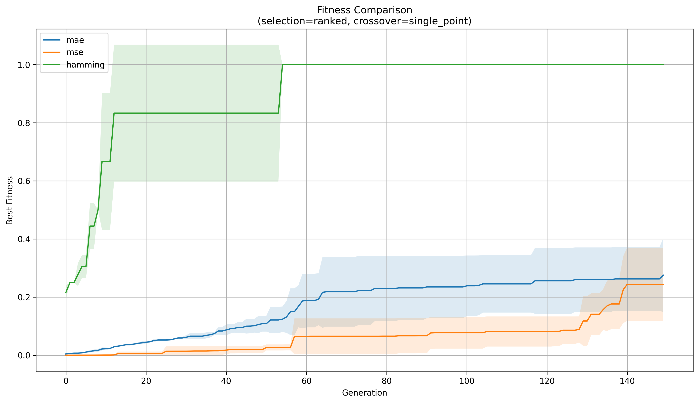
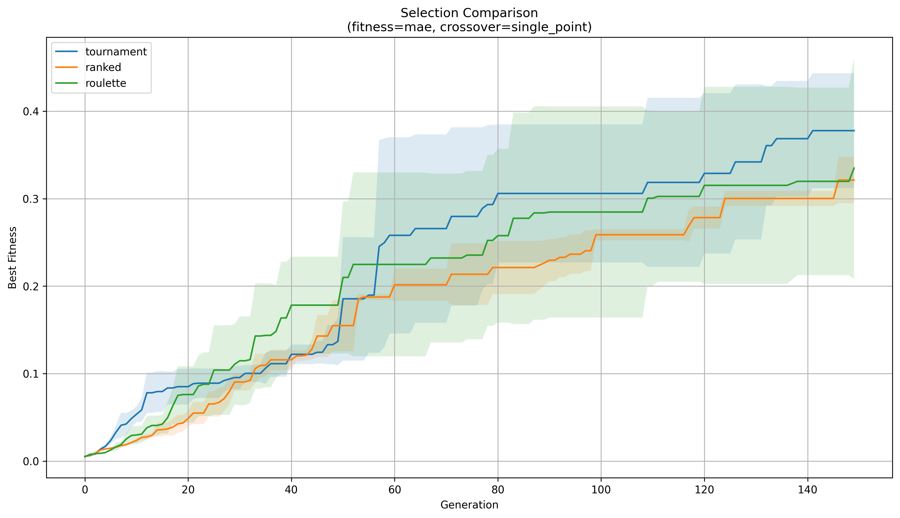
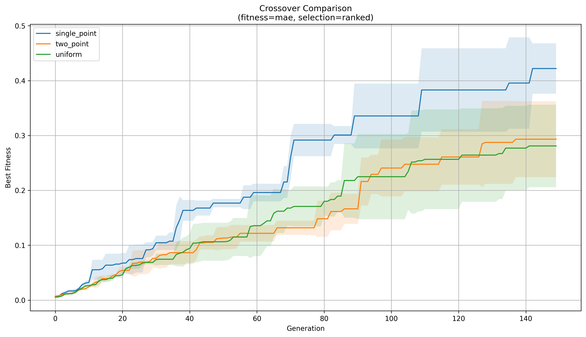

# Genetic Melody Reconstruction

A genetic algorithm that evolves a population of random frequency sequences until one of them converges on a target melody extracted from an audio file.

## Overview

The pipeline has two halves. First, a target `.wav` file gets sliced into fixed-length chunks, and an FFT pulls out the dominant frequency in each chunk (silence chunks get mapped to 0). That sequence of frequencies is the "genome" the algorithm is trying to reconstruct. Second, a `GeneticAlgorithm` class evolves a population of random frequency sequences toward that target using configurable fitness, selection, and crossover strategies, and the best chromosome at the end gets synthesized back into an audio file so you can actually hear what the algorithm learned.

Nine target melodies are included (Für Elise, Bella Ciao, the Game of Thrones theme, Interstellar, Mario, Pink Panther, Harry Potter, Squid Game, Swan Lake), so there's a decent range of tempo and pitch range to test against.

## Results

I ran a comparison sweep (3 runs each, 150 generations, population of 100) to see which fitness/selection/crossover combination actually converges fastest on a 5-note target sequence:







MAE-based fitness gave the smoothest, most consistent convergence of the three error metrics. It's forgiving of small per-note deviations, which matters here because frequencies are continuous, not categorical. For selection, tournament (with a couple of elites kept aside each generation) held the best balance of the three: roulette wheel is prone to premature convergence whenever one individual's fitness dominates the wheel, and pure rank-based selection was more stable but slower to close the gap in later generations. For crossover, single-point edged out uniform and two-point, since gene position corresponds to a point in time and keeping the prefix/suffix structure roughly intact turned out to matter more than I expected going in.

Two synthesized outputs from the best-found chromosome are in `results/audio_samples/`: a clean sine-wave version for checking pitch accuracy, and an "ultimate" version with harmonics, vibrato, and echo layered on for something more listenable.

## Features

- FFT-based frequency extraction from raw `.wav` audio, with an amplitude-based silence threshold
- `GeneticAlgorithm` class with five fitness functions (MAE, MSE, Hamming-style mismatch count, correlation, a multiset-Jaccard variant), four selection strategies (tournament, roulette wheel, rank-based, elitism), and three crossover operators (single-point, two-point, uniform)
- Elitism carried through every generation so the best chromosome is never lost to random sampling
- Vectorized NumPy operations throughout: population, fitness, and mutation are all array ops, not Python loops over individuals
- Batch comparison harness that runs each method combination multiple times and plots mean fitness ± std dev per generation
- Two audio synthesis modes (clean sine-wave vs. harmonics/vibrato/echo) to turn the evolved chromosome back into sound

## Tech stack

- Python 3
- numpy (population and fitness vectorization)
- librosa, soundfile, scipy (audio I/O and FFT-based pitch extraction)
- matplotlib (convergence and comparison plots)

## Setup

```bash
git clone https://github.com/sarina-mh/genetic-melody-reconstruction.git
cd genetic-melody-reconstruction
pip install -r requirements.txt
```

## Usage

Open `notebooks/Genetic.ipynb` in Jupyter and run top to bottom.

1. **Extract a target**: point `extract_frequencies_from_wav` at one of the files in `data/target_melodies/` (or your own `.wav`) and pick a `note_duration`. Shorter durations give finer pitch resolution but a longer chromosome to evolve.
2. **Run the GA**: instantiate `GeneticAlgorithm(target_frequencies, pop_size, generations, mutation_rate, min_freq, max_freq)` and call `.run(fitness_method=..., selection_method=..., crossover_method=...)`.
3. **Reproduce the comparison plots**: run `compare_ga_methods_to_files(...)`. It re-runs the GA once per method under test and writes the three PNGs in `results/plots/`.
4. **Listen to the result**: pass `ga.best_chromosome` into `frequencies_to_melody(...)` for a clean tone, or the harmonics/vibrato/echo variant for something closer to music.

## Project structure

```
genetic-melody-reconstruction/
├── README.md
├── LICENSE
├── requirements.txt
├── .gitignore
├── notebooks/
│   └── Genetic.ipynb              # extraction, GA implementation, comparison sweep, synthesis
├── data/
│   └── target_melodies/           # 9 source .wav files used as extraction targets
└── results/
    ├── plots/                     # fitness / selection / crossover comparison charts
    └── audio_samples/             # synthesized output from the best evolved chromosome
```

## Notes

- Chromosome length scales directly with `note_duration` and clip length, so the search space grows fast: it's roughly `(max_freq - min_freq + 1)^chromosome_length`. A 40-note target with a 0-2000 Hz range already sits around 10^132 possible chromosomes.
- Direct comparison against the target (rather than rewarding local note-to-note regularity) is what keeps the fitness pressure pointed at the actual target instead of some internally-consistent but unrelated pattern.

## Author

Sarina Mahmoudi. [github.com/sarina-mh](https://github.com/sarina-mh)

## License

This project is licensed under the MIT License. See [LICENSE](LICENSE) for details.
